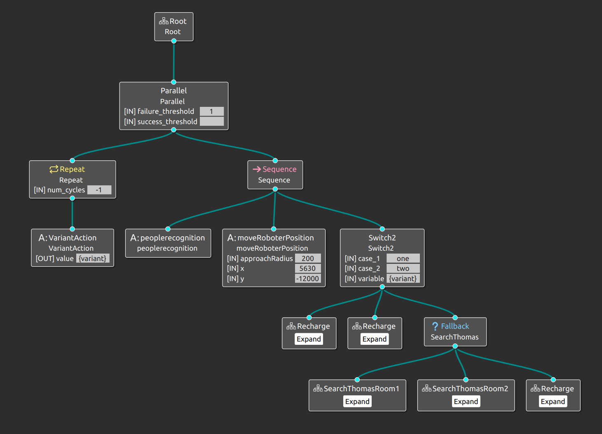
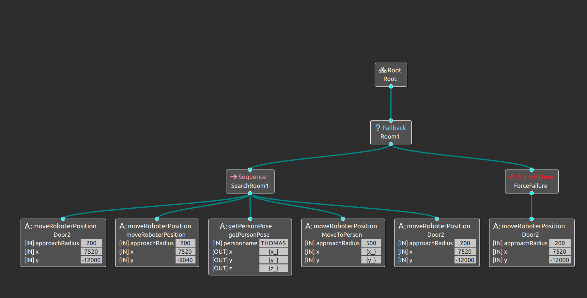

# Assistive Robots

The healthcare scenario: a retirement home, an assisted living facility, was the 
first use case to demonstrate MiRoN’s capabilities.  The general idea is to 
robotize the comprehensive geriatric assessment, using a mobile robot to find 
and identify elderly people in the environment and to interact with them, 
dialoguing, leading to the medical centre, reminding medication, or exercise.  

The objective of this first use case is to build a simulation and working 
environment of a retirement home, with static obstacles (furniture) and people, 
using Smartsoft and Webots Simulator. The mobile robot is the Tiago-Iron 
(Pal Robotics) and its first task is to find and identify a person in the 
environment, navigating safely.

The robot navigates in a complex environment with several obstacles and people.
The extended behaviour tree (BT) is showed below:

In this example, the robot will search for a person named Thomas in two rooms. 
A global planner is not available in this example, thus the path is hardcoded 
in the BT as a sequence of waypoints, see the SearchThomasRoom1 BT below:

The robot has a recognition algorithm to verify if the person is Thomas. It 
saves the person's info and pose in the robot's database. The robot queries the 
database for Thomas's pose and, if it is available, the performs a "GoTo" to the 
pose, otherwise, it goes back to the room's door and try to search i the next 
room.

If Thomas is found or if there is no room left, the robot goes to the docking 
station.

# Adaptation

The **Adaptation** tool geenrates the extended BT with variation points. The 
variations, in this example, is related to the robot's speed and the change of 
mission strategy:
* The robot's maximum speed changes accordingly with the non-functional property
"**safety**". I.e. if "**safety**" is undermined, the robot navigates slower.
The **safety** is undermined if the robot is too close to a person, object or 
walls.
* If the non-functional property "**power_autonomy**" is too low, the robot 
changes the mission strategy. The choosen variant will be "Recharge", thus the 
robot stops the searching procedure and goes directly to the docking station.

# Tutorial

The RetirementHome Scenario is in the `retirement` branch in MiRoN. To 
test it, one must checkout to the beforementioned branch on the following 
repositories:

* [MIRON-Components](https://github.com/MiRON-project/MIRON-Components)
* [MIRON-Systems](https://github.com/MiRON-project/MIRON-Systems)
* [bundles](https://github.com/MiRON-project/bundles)

And run the system, as explained in the Documentation section.

# Videos

