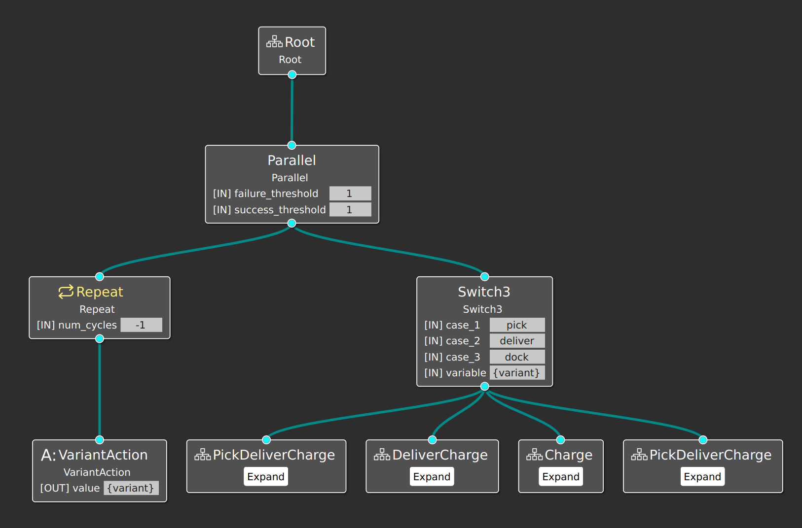
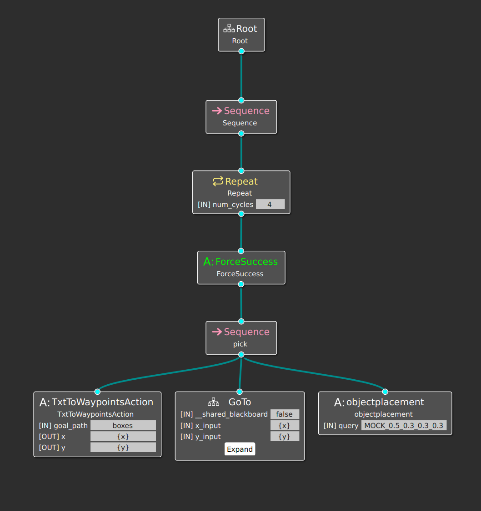
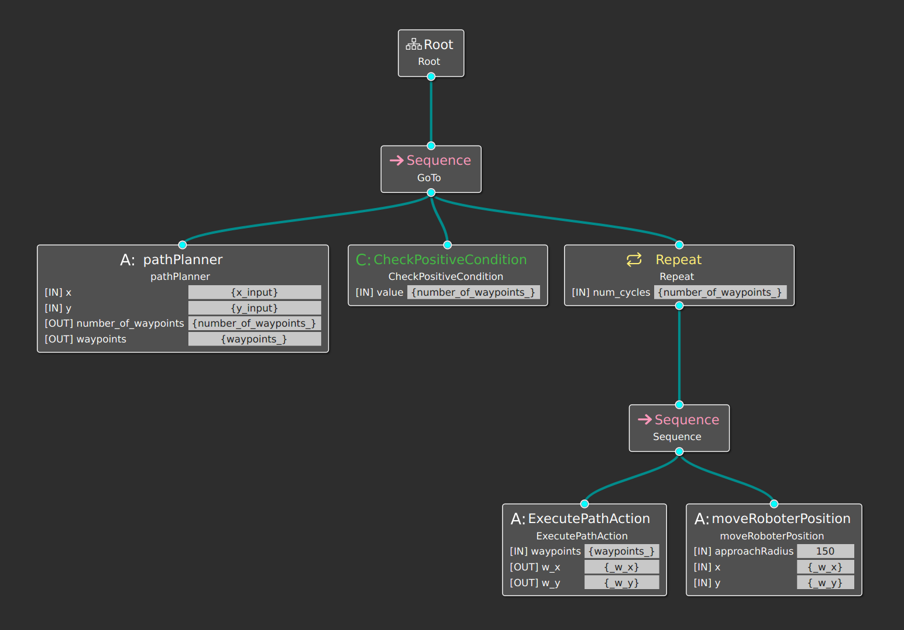

# Intralogistics

In this simulation, we mock an intralogistics environment. The robot's mission 
is to pick four boxes on different places, with people, then delivered them (one 
fixed place) and finally dock to charge. The robot does not know about dynamic 
obstacles in the environment, and it does not know beforehand the weight of the 
boxes. Therefore it may be impossible to pick and deliver all boxes in one round.

The robot navigates in a complex environment with several obstacles and people.
The extended behaviour tree is showed below:

The default behaviour is to pick four boxes, fixed goals (x, y):
`{(-4.81, -1), (3.93, 2.68), (5.43, 6.63), (-3.05, 6.63)}`. The image below 
shows how it is performed in the BT:

The `TxtToWaypoints` actions reads the goals one-by-one, and the GoTo subtree 
generates waypoints to achieve it.

The `pathPlanner` action calls the OMPL global planner to generate feasible 
waypoints (no static obstacles in the path) and the `ExecutivePathAction` is the
local planer to avoid new unknown obstacles.

# Adaptation

The **Adaptation** tool geenrates the extended BT with variation points. The 
variations, in this example, is related to the robot's speed and the change of 
mission strategy:
* If the non-functional property "**safety**" is too low, the robot will drop the 
current pick position and it continues to the next one.
* The robot's maximum speed changes accordingly with the non-functional property
"safety". I.e. if "**safety**" is undermined, the robot navigates slower.
* If the non-functional property "**power_autonomy**" is too low, the robot 
changes the mission strategy. The choosen variant will be "Charge", thus the 
robot stops the picking procedure and goes directly to the docking station.
* If the non-functional property "**mission_completion**" is too high, the robot 
accomplishes the picking mission and the variant is to go to the deliver point.
Note that the robot cannot know beforehand if it is possible to carry all boxes
in one round, thus the **mission_completion** may be high with only one or two
picked boxes.

# Tutorial

The Intralogistics Scenario is the current main (master) branch in MiRoN. To 
test it, just make sure to checkout to the master branch of MiRoN components:

* [MIRON-Components](https://github.com/MiRON-project/MIRON-Components)
* [MIRON-Systems](https://github.com/MiRON-project/MIRON-Systems)
* [MOOD2Be](https://github.com/MiRON-project/MOOD2Be)
* [bundles](https://github.com/MiRON-project/bundles)
* [MIRON-BehaviorRepository](https://github.com/MiRON-project/MIRON-BehaviorRepository)

And run the system, as explained in the Documentation section.

# Videos

