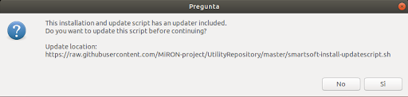
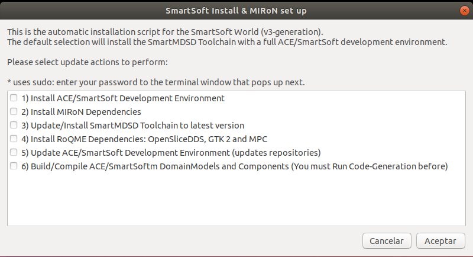
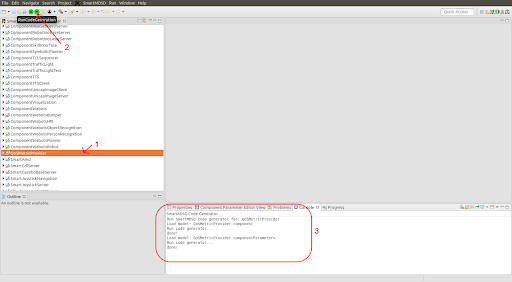
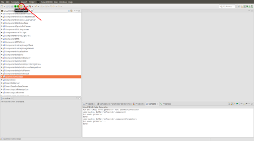
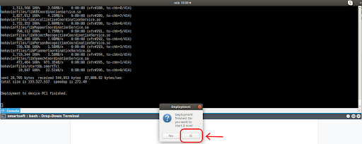
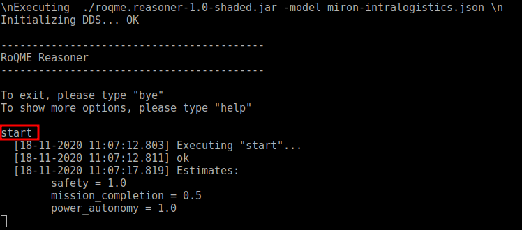
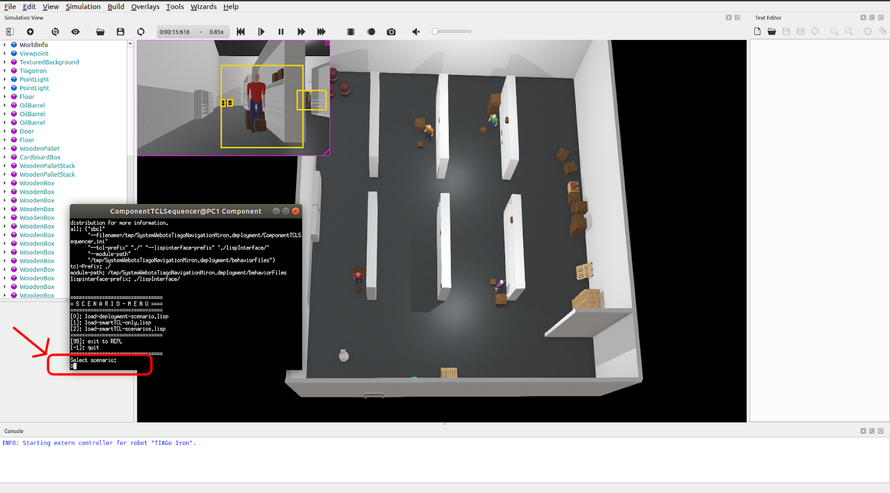

# MIRoN installation

## Pre-installation

MIRoN project has been developed and tested in Ubuntu 18 LTS. We encourage download and install this version and update repositories and packages.

Install additional packages: 

```
sudo apt-get install xterm libjsoncpp libzmq3-dev
```

Install [Quicklisp](https://www.quicklisp.org/beta/) following the instructions, and the cffi module with Quicklisp.

---
## Installation of SmartMDSD Toolchain and MiroN Components


Download the [installation script](https://github.com/MiRON-project/UtilityRepository/blob/master/smartsoft-install-updatescript.sh), and copy it into the home folder.

Start the script using the following command:

```
bash smartsoft-install-updatescript.sh 
```

Once started, select “yes” (update the script before continuing) 



Then, select all the options. 



It is worth noting that before building the system, option (6), one must run code generation with the Smartsoft Toolkit for all components (DomainModels, Components and Systems). The Script does not run "code generation" by itself. One must do it manually always before building the system, as is explained in the next step.


1. **ACE/SmartSoft**: option (1) installs the ACE-6.5.8 version and its dependencies.
2. **MiRoN Dependencies**: option (2) installs the Webots Simulator, MRPT (metapackage for robot localization), and OMPL (metapackage for robot navigation). One must check with the _~/.profile_ file has the MRPT and Webots paths properly set.
3. **RoQME**: option (3) installs MPC and OSPL (OpenSpliceDDS). One should check if the environment variables are properly set in the _~/.profile_ (ROQME_ROOT, CPATH, MPC_ROOT, OSPL_HOME). Check the script content (open the .sh file in an editor) to check how those variables should be set.
4. **Update**: option (5) tries to checkout all github repositories to the [Miron-Organization](https://github.com/MiRON-project). If one does not belong to it, one should manually change the repositories (ComponentRepository, SystemRepository and so on).
5. One must import and run code generation before compiling all the components. In Eclipse, one should import components/modules using “File -> Import -> Projects from Folder or Archive”, as is depicted in the following picture. Please,  import them in the following order (they are available in ~SOFTWARE/smartsoft/repos):

   * MIRON-BehaviourRepository
   * BehaviourRepository
   * MIRON-Components
   * AROSYS-Components
   * ComponentRepository
   * DomainModelsRepositories
   * MIRON-Systems
   * AROSYS-Systems
   * SystemRepository



6. Once all the modules are imported in SmartSoftMDSD toolchain, run code generation selecting the module and the button “Run Code Generation”. For instance, the following picture shows how to execute Run Code Generation for the QosMetricProvider component. It is worth noting one must perform this action for all modules/components imported into the tool. 



7. Then one can compile all the components/modules in three different ways:
    * By choosing the “build” option in the installation script from the SmartMDSD toolchain, selecting the component/module and “build project”.
    * From the Eclipse
    * From a terminal, just going to the component path (for instance “~/SOFTWARE/smartsoft/repos/ComponentRepository/MIRON-Components/QoSMetricProvider/smartsoft” folder) and execute:

      ```
      mkdir build
      cd build
      cmake ..
      make
      ```

---
## Installation of the MIRoN Modeling Tools

1. Download the MIRoN Eclipse plugin (MIRoN-Eclipse-Tools-vXXXX) from
https://github.com/MiRON-project/Miron-Framework/tree/master/Tools/Eclipse-Modeling-Tools/Plugins. Note that the MIRON modeling tools require the installation of the RoQME plugins. Optionally, you can choose RoQME-MIRoN-Eclipse-Tools-vXXXX, which contains all the RoQME and MIRON plugins.

2. Create a new “MIRoN” folder at “/home/smartsoft” and extract the file previously downloaded in (1).

3. Launch Eclipse and install the MIRoN plugin in Eclipse, by selecting the following menu options:
Help - > Install New Software… - > Add… - > Local… - > {Repository path}

4. Restart Eclipse 

---
## Sytem Run

Start the system by running "bash src-gen/deployment/deploy-all.sh" on a terminal in the path “~/SOFTWARE/smartsoft/repos/SystemRepositories/MIRON-Systems/SystemWebotsTiagoNavigation/smartsoft”

Once the deployment is complete, choose "yes":


    
The BT.CPP, Groot, ZMQBroker, and the Miron Engine start automatically with the system. However, RoqME does not. One must run the CEP and Reasoner on two separate terminals. To do so, go to QoSMetricsProvider component path (/home/zotac/SOFTWARE/smartsoft/repos/ComponentRepository/MIRON-Components/QoSMetricProvider) and:

1. Go into “CEP” folder and start the complex event processor using the following command:
   ```
   java -jar cep.jar 
   ```
2. Go into “reasoner” folder and start it choosing the proper json file (some examples are provided, as is detailed  in XXX). Then execute “start” and press Enter.



Then choose the option "0" in the ComponentTCLSequencer console:



